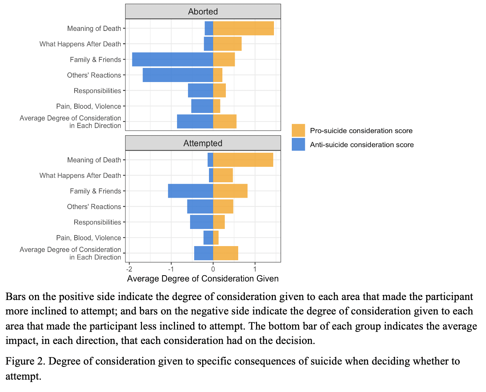
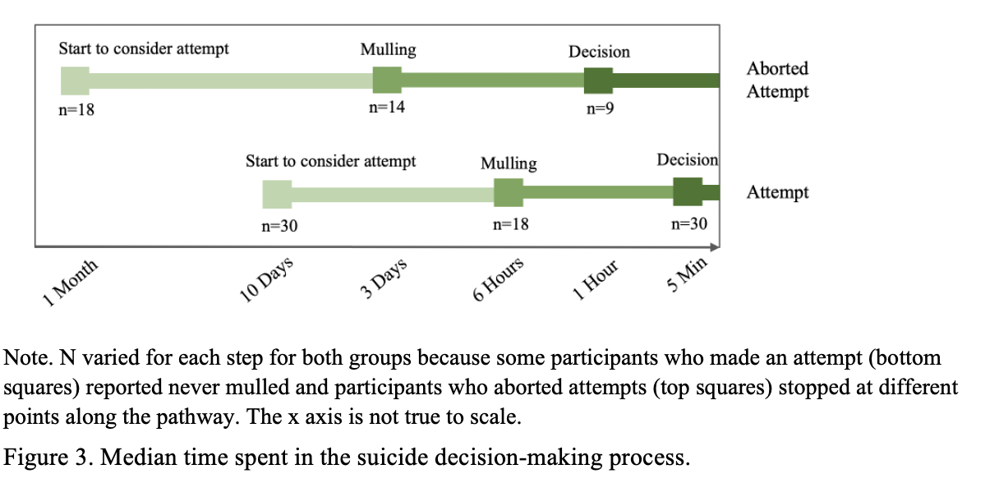
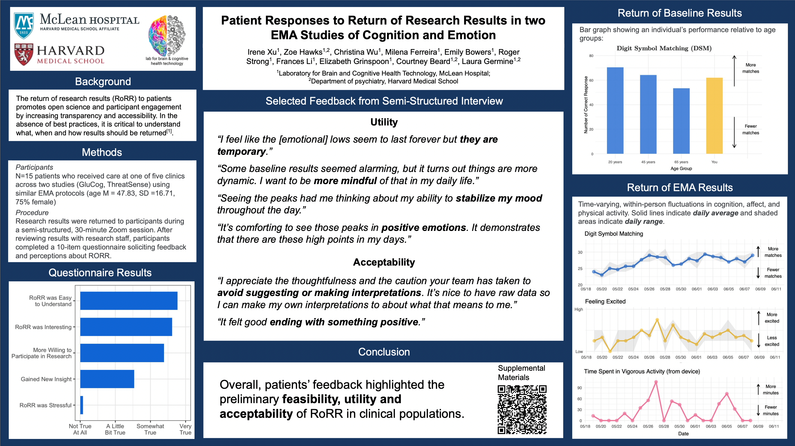

Last Updated: `r Sys.Date()`

 

#### **Preprint**   

**Xu, I.**, Passell, E., Strong, R., Grinspoon, L., Wu, C., Jung, L., Wilmer, J., & Germine, L. (2022). No evidence for consistent reliability across 36 variations of the emotional dot probe task in 9,000 participants. [Preprint](https://www.psyarxiv.com/58z4n)

***
#### **Selected Manuscript In Prep**   

**Xu, I.**, Millner, A. J., Fortgang, R., & Nock, M. K. How considering the consequences of suicide impacts the decision to attempt suicide: People who attempted Suicide and people who aborted their attempts. 

**Abstract**   
Introduction: The period leading up to a suicide attempt when people transition from suicidal ideation to making suicide attempts involves a decision-making process during which people weigh the reasons for and against suicide. However, existing studies mostly used proxy measures, such as time spent in contemplation, to estimate the degree to which people consider the consequences of suicide in this process. The studies that directly measured considerations did not measure it in the context of making the decision to attempt. The current study aimed to assess how people consider the consequences of suicide in the decision-making process and whether considerations of specific consequences influenced their ultimate decision to attempt or not.   

Methods: Among 50 inpatients adults who had made a suicide attempt or aborted a suicide attempt in the prior two weeks, we asked to what degree did they consider six consequences related to suicide and whether these considerations make them more or less (also in both or neither direction) inclined to attempt. We also measured the time when they first started to consider suicide, mulled over suicide, and decided to attempt suicide.   

Results: All participants who aborted their attempts stated that they considered the consequences of suicide, while only 87% of attempters claimed to have considered the consequences. When we looked at the total nondirectional considerations, the two groups thought of consequences to similar degrees. However, those who aborted were more likely to consider the consequences, especially interpersonal ones, as motivations for living than dying. In addition, those who aborted spent more time in the whole decision-making process than attempters.    

Conclusion: As expected, **how**, in addition to **how much**, people considered the consequences of suicide was related to their ultimate decision on whether to attempt. Though the decision-making process was correlated with the total degree of consideration, the correlation was weak, suggesting that time is not a reliable measure of consideration.   

{width=70%}

{width=62%}

***
#### **Recent Posters**    

**Xu, I.**, Hawks, Z., Wu, C., Ferreira, M., Bowers, E., Strong, R., Li, F., Grinspoon, E., Beard, C., Germine, L. (Sept 2022). Patient Responses to Return of Research Results in two EMA Studies of Cognition and Emotion. Poster Presented at Society for Research in Psychopathology, Philadelphia, PA. [Link](https://docs.google.com/presentation/d/1-WbuhEclD7IrZZjmDVyVom3fcIL_4GPd/edit?usp=sharing&ouid=100799767484704214514&rtpof=true&sd=true)    
    

 

Grinspoon, E., Jung, L., Li, F., Passell, E., Scheuer, L., Hawks, Z., Strong, R., Singh, S., **Xu, I.**, & Germine, L. (Sept 2022). How Does Returning Cognitive Test Results Impact Performance over Time? Poster Presented at Society for Research in Psychopathology, Philadelphia, PA. [Link](https://docs.google.com/presentation/d/1II4foE8VE4SZqOMAfn9_np9FM38qJ6FV0fulmYlXPAw/edit?usp=sharing)

Wu, C., **Xu, I.**, Passell, E., Beard, C., & Germine, L. (March 2022). The Older, the Merrier: Older Adults Have Greater Positive Interpretation Biases. Poster Presented at Harvard Psychiatry Research Day. Cambridge, MA. [Link](https://docs.google.com/presentation/d/1UTG1GWxcFLKsCgSQqMXULOJ_6i_-IvXWxxqIvZqVy2E/edit?usp=sharing)

**Xu, I.**, Passell, E., Strong, R., Grinspoon, E., & Germine, L. (March 2022). Attentional Bias for Threat: Reliability of 36 Versions of the Threat Dot Probe Task. Poster Presented at Harvard Psychiatry Research Day, Cambridge, MA. [Link](https://docs.google.com/presentation/d/1aCFDA1ghLOf54COhUPxD1bBCbIa4845D/edit?usp=sharing&ouid=100799767484704214514&rtpof=true&sd=true)

 

Share your comments, concerns, suggestions, or additional resources [here](https://forms.gle/DQfojqWRTGQ8mjq2A). 