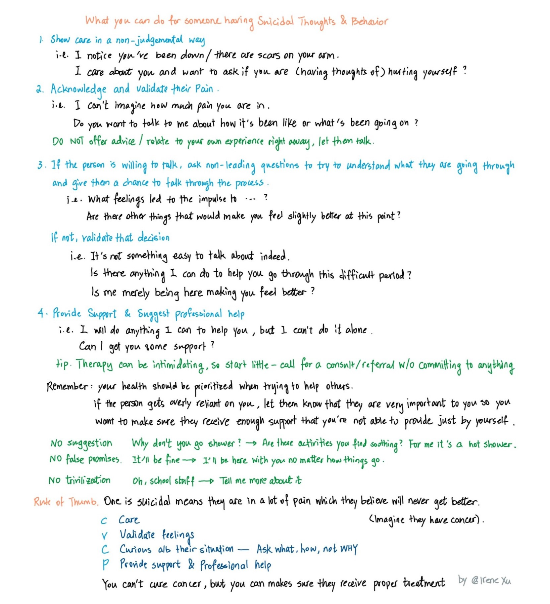

Last Updated: `r Sys.Date()`

 

#### **If you feel suicidal**
**These resources MAY arrange emergency services if they determine you are in a crisis**   

[What Happens When You Call Into A Suicide Prevention Hotline](https://www.buzzfeednews.com/amphtml/carolinekee/what-happens-when-you-call-suicide-hotline)

* [Crisis Text Line](https://www.crisistextline.org/) Text HOME to 741741  

* [Veterans Crisis Line](https://www.veteranscrisisline.net/) Call, Text, or Chat  

* Call [Trevor Lifeline](https://www.thetrevorproject.org/), 1-866-488-7386, a free and confidential suicide hotline for LGBT youth.

* Call the National Hotline [988](https://988lifeline.org/). If you are a Spanish speaker, call the Spanish-language Lifeline at 1-888-628-9454. Si hablas español, llama a [1-888-628-9454](https://988lifeline.org/help-yourself/en-espanol/). Lifeline ofrece 24/7, gratuito servicios en español.   

* [A List of International Suicide Hotlines](http://www.suicide.org/international-suicide-hotlines.html)

 

#### **Suicidal as a minority**
**These resources DO NOT call the police on you**

* [Trans Lifeline](https://translifeline.org/) 1-877-565-8860   

* [Call BlackLine](https://www.callblackline.com/) 1-800-604-5841    

* [Samaritans NYC](https://samaritansnyc.org/) 1-212-673-3000  

  

#### **Why approach matters**
**Why do we care about the approach (active vs. no active rescue) these hotlines take?**   
(some adapted from this [Twitter thread by Dr. Emily Krebs](https://twitter.com/SaltySicky/status/1568751393086783494))

* People experience suicidal thoughts differently. A person may suddenly become suicidal following a recent event, or they can be chronically suicidal, meaning that they always consider suicide as an option at the back of their mind.

* Being suicidal does not mean that a person will carry out suicidal behaviors or need to be immediately hospitalized.

* Yes, hearing that a loved one is thinking about suicide can be incredibly scary, but calling emergency services on them may not be the most helpful approach.   

* Reporting someone for being suicidal can get them [kicked out of college](https://www.washingtonpost.com/dc-md-va/2022/11/11/yale-suicides-mental-health-withdrawals/), [fired from jobs](https://www.reddit.com/r/SuicideWatch/comments/vsw4b/update_to_just_got_fired_for_being_suicidal/), and sometimes even [lose custody of their kids](https://farzadlaw.com/can-a-suicidal-parent-lose-custody). **Mandatory reporting policies are dangerous & are aimed at protecting businesses and organizations from liability, not helping people.**   

* The United Nations has called involuntary psychiatric care a form of torture but it's still regularly practiced on suicidal patients in the US. Involuntary 72-hour ("5150") holds are the norm for people deemed a threat to themselves. 5150 holds are one of the only legal circumstances in the USA where people can be forced to undergo medical treatments and ingest food or liquids against their will. (The other circumstances include treatment of minors, intellectually disabled adults, and incarcerated people.) 

* Suicide risk following involuntary psychiatric hospitalization skyrockets [$^1$](https://pubmed.ncbi.nlm.nih.gov/31162700/) [$^2$](https://www.ncbi.nlm.nih.gov/pmc/articles/PMC5710249/). While 5150 holds may prevent a person from dying in one moment of crisis, they don't protect people long term. 988 openly engages in *nonconsensual* active rescue despite its harms and lack of effectiveness. **Callers seeking phone support can end up being escorted by police to a psychiatric hospital against their will--sometimes at gunpoint if the officers deem the person dangerous.** Individual who belong to racial or gender minority groups or have disabilities face much greater risk of being further traumatized.   

* The hotlines that do not involve the police or nonconsensual active rescue are provided above. (This is likely not an exhaustive list, please let me know with the feedback form on the bottom of this page if there are other hotlines I might have missed.)  

 

#### **If you lost someone to suicide**  

* [Alliance of Hope for Suicide Loss Survivors](http://www.allianceofhope.org/) has many resources about people's grief journey, including a forum for the community and support groups    

 

#### **If you want to learn**

**Learn from the lived experiences of suicide survivors**

* [Live Through This](https://livethroughthis.org/) has an incredible collection of narratives shared by suicide survivors. *Trigger warnings.        

 

**Learn about anti-carceral mental healthcare practices (meaning care where patients don't lose their rights or autonomy)**

* "[Project LETS](https://linktr.ee/projectlets) is a national grassroots organization and movement led by and for folks with lived experience of mental illness/madness, Disability, trauma, & neurodivergence... We work for and with multiply marginalized folks in our communities to provide access, political education, & material resources that are needed to survive and thrive. "

* "[Fireweed Collective](https://fireweedcollective.org/) offers mental health education and mutual aid through a Healing Justice and Disability Justice lens." They provide support groups, workshops, and an awesome [crisis toolkit](https://fireweedcollective.org/crisis-toolkit/). 

* "[Mad In America](https://www.madinamerica.com/)’s mission is to serve as a catalyst for rethinking psychiatric care in the United States (and abroad). We believe that the current drug-based paradigm of care has failed our society, and that scientific research, as well as the lived experience of those who have been diagnosed with a psychiatric disorder, calls for profound change." They use "a mix of journalism, education and societal discussion" to "provide the seed for a much-needed remaking of mental health care in the United States and globally."

* [Trans Lifeline](https://translifeline.org/) has an incredible [resources page](https://translifeline.org/resources/) for all sorts of struggles, especially for people with minorotized gender and racial identities with limited financial resources.   

 

#### **Help a loved one in crisis**

* There are many resources online on how to help someone who is struggling with suicidal thoughts (e.g., [here is a good one](https://fireweedcollective.org/publication/navigating-crisis/)), 

* But most are rather lengthy so I made this 2-page cheatsheet for my friends who want to support others in need. I hope this can help others as well. [download](media/Suicide_Peer_Intervention.pdf)    

Here is a preview   
{width=70%}

 

Share your comments, concerns, suggestions, or additional resources [here](https://forms.gle/DQfojqWRTGQ8mjq2A). 

